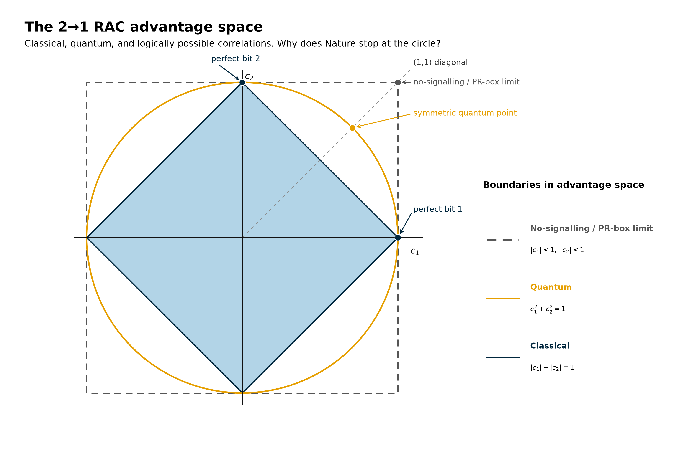
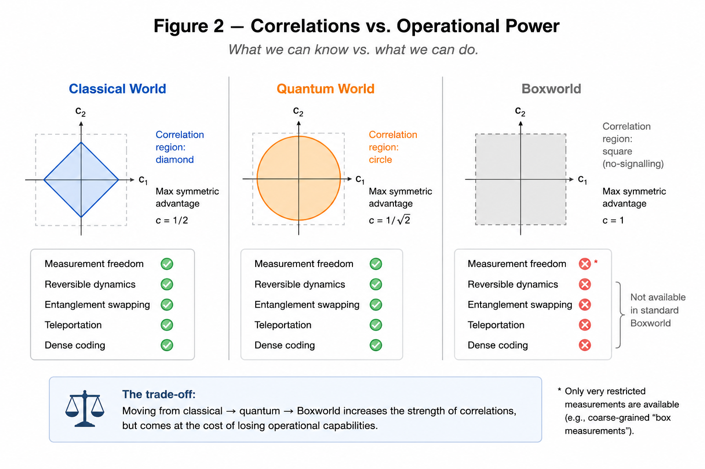
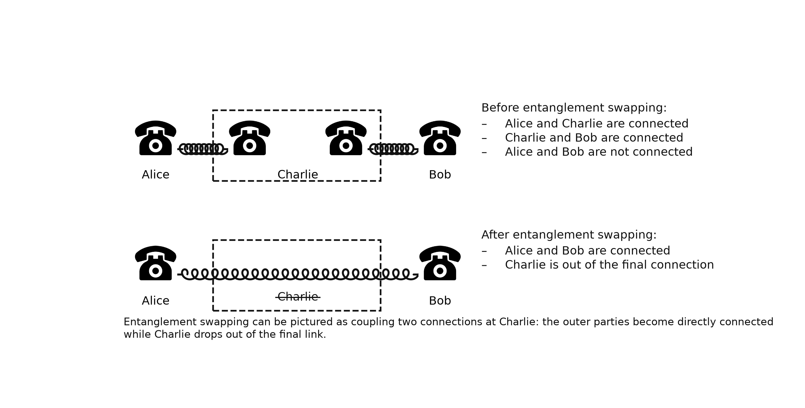
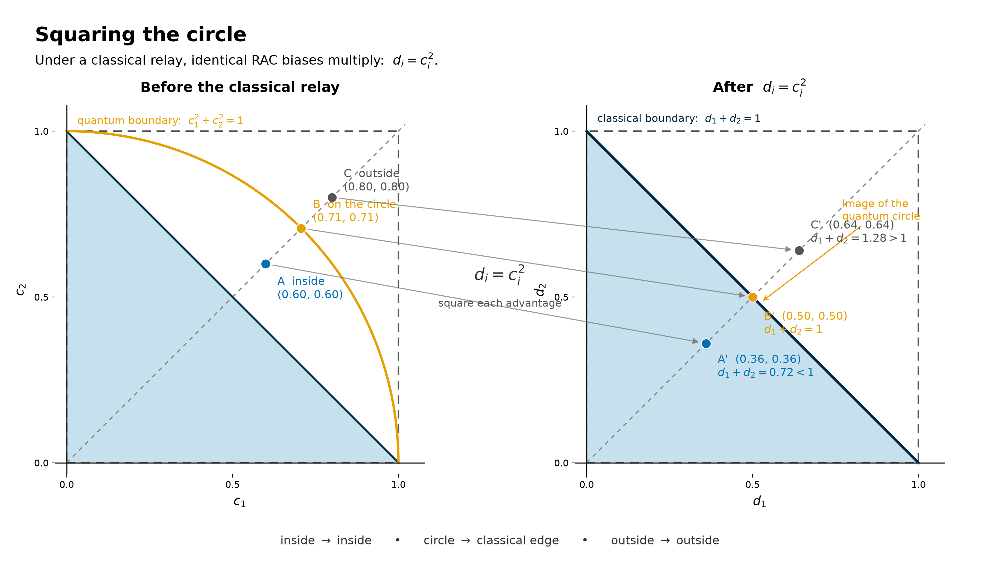

# Did Nature Do Us a Favor by Being Quantum?

### *Is quantum mechanics the optimal balance between what we can know and what we can do?*

<!--
BLOG 5 — RAC SERIES

CENTRAL QUESTION

Blog 3 showed the geometry:
classical strategies become complicated, while the quantum RAC boundary becomes a sphere.

Blog 4 asked whether an information-theoretical principle explains why Nature stops at that boundary.

Blog 5 asks a different question:

Perhaps stronger correlations are not simply "better".
Perhaps they come at a price in the measurements, transformations and network operations
a physical theory can support.

Jonathan Barrett's state/dynamics trade-off is the central hypothesis.

Keep the article operational:
- what can Alice and Bob know?
- what measurements can they choose?
- can resources be connected?
- can nonclassical correlations be created and transformed?

Do NOT teach GPT formalism, cones, dual spaces or effect geometry.

The RAC remains the common measuring stick throughout.

SCIENTIFIC DISCIPLINE

Distinguish clearly between:

1. Established results:
   - PR/Boxworld correlations can exceed the quantum RAC/CHSH limit.
   - Standard Boxworld has restricted measurements and reversible dynamics.
   - Standard Boxworld has no Bell-measurement analogue, entanglement swapping,
     teleportation or dense coding.
   - Recent GPT constructions show that stronger-than-quantum correlations do
     not generically imply poor dynamics.

2. Our interpretation:
   - Quantum mechanics may occupy a particularly powerful balance between
     correlation strength and dynamical richness.

3. Our RAC observation:
   - Under the deliberately classicalized relay dᵢ=cᵢ², the 2→1 quantum circle
     maps exactly onto the classical RAC edge.
   - Treat this as a suggestive shadow of the broader trade-off, NOT as a
     derivation of the quantum boundary.
-->

---
In everyday life, more usually sounds like an upgrade: a stronger signal, a faster connection, a more powerful computer. Physics occasionally disagrees. 

In the previous posts we found exactly this puzzle in our guessing game. Quantum correlations let Alice and Bob outperform every classical strategy—but hypothetical correlations can be stronger still. If all we care about is Bob's ability to guess Alice's bits, why wouldn't stronger always be better?

Almost twenty years ago, Jonathan Barrett suggested a very different way of looking at that question:
> “Quantum theory achieves in some sense an optimal balance of allowed states and dynamics.” — Jonathan Barrett, 2007

Perhaps the remarkable thing about quantum mechanics is not how far its correlations reach, but what we can still do with them. In this post we will ask whether moving beyond the quantum boundary buys us more knowledge at the price of poorer measurements, transformations and connections between physical systems.

## When Knowing More May Mean Doing Less

<!--
GOAL:
Reconnect Blogs 3 and 4 very quickly.

Do not repeat the Information Causality article.
Within ~200 words establish:

- classical diamond;
- quantum circle;
- no-signalling/Boxworld square;
- judged only by the RAC, farther out looks better;
- Blog 4 asked whether information theory explains why Nature stops;
- now change the question from "how strong?" to "what can we do with it?"
-->
Alice and Bob play [QSeaBattle](https://robhendrik.github.io/QSeaBattle/), a simple guessing game we have used throughout this series. Alice receives a bitstring and may send Bob one bit. Bob is then asked for the value at one particular index, without Alice knowing beforehand which index he will be asked about.

Classically there is a proven limit to how well they can do. Quantum resources let them exceed it.

We describe Bob's performance using the advantage. If Pᵢ is his probability of correctly guessing bit i, we define

*cᵢ* = 2*Pᵢ* − 1.

So *cᵢ* = 0 means random guessing, while *cᵢ* = 1 means perfect retrieval.

For the two-bit game, the three familiar regions are

classical:

|*c₁*| + |*c₂*| ≤ 1,

quantum:

*c₁*² + *c₂*² ≤ 1,

and the perfect-retrieval limit:

|*c₁*| ≤ 1, |*c₂*| ≤ 1.

Along the symmetric direction, the achievable advantage therefore increases from *c* = 1/2 classically, to *c* = 1/√2 quantum mechanically, and finally to *c* = 1 for a PR-box resource.

If that were the whole story, the ranking would seem obvious:

**classical < quantum < Boxworld.**

But what if moving farther outward gives us stronger correlations while simultaneously taking something else away?

### Figure 1 — The Three RAC Worlds

> *Figure 1: Three boundaries for the same two-bit guessing game. Classical one-bit strategies fill the diamond, quantum-assisted strategies reach the circle, while no-signalling correlations can reach the surrounding square. Judged only by Bob's ability to retrieve Alice's bits, farther outward appears better.*

> Alt text: *Two-dimensional RAC advantage space with horizontal axis c₁ and vertical axis c₂. A blue classical diamond lies inside an orange quantum circle, which lies inside a dashed grey no-signalling square. Along the positive diagonal, marked points show the symmetric classical strategy, the quantum point and the PR-box corner at c₁ = c₂ = 1.*

> **Judged only by what Bob can know, Boxworld wins. But correlation strength may not tell us what a world lets us do.**

---

## Barrett's Trade-Off

<!--
GOAL:
Make this the conceptual centre of the article.

Introduce GPTs in ONE operational paragraph only:
a theory must specify possible preparations, measurements, transformations and
ways of combining systems.

Then introduce Barrett 2007.

Important distinction:
Barrett explicitly identifies the state/dynamics trade-off.
His explicit final hypothesis concerns computational optimality.
"Quantum is the optimal balance between correlations and dynamics" is OUR
question motivated by Barrett, not a theorem or exact Barrett claim.
-->
Popescu and Rohrlich showed that relativity does not force Nature to stop at the quantum boundary: stronger-than-quantum correlations can still obey no-signalling [1].

But correlations are only one part of a physical theory.

A complete operational theory must also tell us which states can be prepared, which measurements can be made, which transformations are allowed, and what happens when systems are connected.

Jonathan Barrett used the framework of generalized probabilistic theories to study exactly this wider question [2]. His generalized no-signalling theory allows **every state compatible with no-signalling**, including states producing the stronger-than-quantum PR-box correlations. In that sense, its space of possible states is larger than quantum mechanics allows. In 2010, Anthony Short and Jonathan Barrett gave this hypothetical world a more memorable name: *Boxworld* [3].

But there is a catch. Any allowed transformation has to act consistently on **all** of those possible states. Barrett found that enlarging the state space so dramatically therefore comes with severely restricted dynamics.

> **“A central insight of this work is that there is a trade-off between the allowed states of a theory and the allowed dynamics.”**
>
> — Jonathan Barrett [2]

Barrett went further. Comparing his hypothetical theories with quantum mechanics, he described quantum theory as achieving a remarkably **“harmonious balance of states and dynamics”**, and asked whether that balance might explain its exceptional information-processing power [2].

This triggers the question that will guide this post:

> **Is quantum mechanics special not because it gives us the strongest possible correlations, but because it gives us an unusually powerful balance between what we can know and what we can do?**
---

## Stronger Correlations Do Not Mean a Richer World

<!--
GOAL:
Make Barrett's abstract trade-off tangible without opening the GPT machinery.

Use the RAC as the left-hand comparison:
- quantum symmetric RAC: c=1/√2;
- PR/Boxworld: c=1.

Then compare operational capabilities.

Short & Barrett:
- stronger-than-quantum entangled states;
- measurements comparatively restricted;
- no Bell-measurement analogue;
- no entanglement swapping;
- no teleportation;
- no dense coding.

Gross et al.:
- reversible dynamics in standard maximally nonlocal Boxworld are essentially
  local relabellings and subsystem permutations;
- no reversible creation of nonlocal states from product states.

Avoid saying every post-quantum theory has these limitations.
-->

For our RAC, Boxworld seems spectacular.

At the symmetric quantum point,

*c₁* = *c₂* = 1/√2,

while a PR-box resource can effectively reach

*c₁* = *c₂* = 1.

Bob's answers become perfect.

But Short and Barrett asked what happens when we demand more than those correlations [3].

Their answer was striking. Standard Boxworld contains states producing correlations stronger than quantum mechanics, but the measurements available on those systems are much poorer.

> **“While box world allows more highly entangled states than quantum theory, measurements in box world are rather limited.”**
> — Anthony Short and Jonathan Barrett [3]

In particular, they found **“nothing analogous to a Bell measurement”** and consequently no ordinary entanglement swapping, teleportation or dense coding [3].

Gross and collaborators found a related restriction on reversible dynamics. In maximally nonlocal Boxworld, reversible transformations reduce essentially to local relabellings and permutations of systems; there is no analogue of a reversible entangling gate that creates a nonlocal state from initially independent systems [4].

So Boxworld is not simply quantum mechanics with the dial turned farther upward.

### Figure 2 — Stronger Correlations, Different Capabilities

> *Figure 2: Stronger correlations do not automatically produce a richer physical theory. In the RAC, standard Boxworld can outperform quantum mechanics and reach the perfect-retrieval corner. Yet the same theory lacks several joint measurements and reversible operations that are available in quantum mechanics.*

> Alt text: *Two-column conceptual comparison. The quantum column shows the symmetric RAC point c₁ = c₂ = 1/√2 together with icons for a Bell measurement, entanglement swapping and reversible entangling dynamics. The standard Boxworld column shows the stronger RAC point c₁ = c₂ = 1, but the Bell-measurement, entanglement-swapping and reversible-entangling-operation icons are crossed out. A heading emphasizes stronger correlations versus available operations.*

> **The RAC geometry shows us the strength of the correlations. It does not show us the price paid elsewhere in the theory.**

---

## Can We Keep the Connection Alive?

<!--
GOAL:
Choose ONE concrete operation to make "dynamics" understandable:
entanglement swapping.

No formal Bell-state algebra needed.

Explain operationally:
Alice--Charlie and Charlie--Bob share independent quantum links.
Charlie performs a joint measurement.
Alice and Bob acquire an entangled connection even though they never directly interacted.

Then contrast:
standard Boxworld has PR-strength links but lacks the required entangled
measurement, so the analogous swapping operation is unavailable.

This is the clearest demonstration of:
stronger individual links != a more capable network.
-->

Entanglement swapping gives us an especially simple way to see the distinction.

Suppose Alice and Charlie share one entangled pair, while Charlie and Bob share another. Quantum mechanics allows Charlie to perform a suitable joint measurement on his two systems. The original links are consumed, and Alice and Bob can end up sharing an entangled state even though they never interacted directly.

The correlations can be **connected**.

Standard Boxworld gives us stronger individual nonlocal correlations, but Short and Barrett showed that it lacks the entangled measurement required to perform the corresponding operation [3].

So we arrive at a peculiar comparison.

A Boxworld link can be stronger than a quantum link.

Yet a quantum network can perform an operation that the standard Boxworld network cannot.

### Figure 3 — Keeping the Connection Alive

> *Figure 3: A telephone-line analogy for quantum entanglement swapping. Charlie joins two independent quantum connections and leaves Alice and Bob with a new nonclassical connection. Standard Boxworld can provide stronger individual correlations, but lacks the corresponding Bell-type joint measurement required for this operation.*

> Alt text: *Two-row telephone analogy. In the first row Alice has one coiled telephone connection to Charlie and Charlie has a separate connection to Bob. Charlie's two local endpoints are grouped together. In the second row a single connection runs between Alice and Bob, while Charlie is crossed out, representing the new outer entangled link created by Charlie's joint measurement.*

<!--
OPTIONAL TRANSITION:

At this point the Barrett picture is deliberately very tempting:
perhaps Nature stops short of maximal correlations because going farther
would destroy precisely the rich operations that make quantum information
useful.
-->

---

## A Curious Shadow in Our Guessing Game

<!--
GOAL:
Bring the discussion explicitly back to RAC advantage space.

This is now a supporting observation, NOT the central proposed explanation.

Introduce the deliberately classicalized relay:
- use independent copies to materialize the possible answers;
- terminate the upstream nonclassical resource;
- only classical records cross the intermediate cut;
- use a fresh independent RAC resource downstream.

For independent errors:
dᵢ = cᵢ².

Then show the 2→1 coincidence:
quantum circle -> classical edge.

Keep the caveat close:
interesting geometric shadow, not a derivation or established principle.
-->

There is a curious echo of this trade-off in the RAC geometry itself.

Instead of using a joint quantum measurement to keep a nonclassical connection alive, suppose we deliberately do the opposite. We terminate the upstream resources, turn their possible answers into ordinary classical records, and only then begin again with a fresh independent RAC resource downstream.

For independent binary errors, the advantages multiply. If the same RAC bias appears at both stages,

*dᵢ* = *cᵢ*².

For the two-bit RAC, something remarkably simple happens.

Every point on the quantum circle satisfies

*c₁*² + *c₂*² = 1.

After the classicalized relay,

*d₁* + *d₂* = 1.

So the entire positive quarter of the quantum circle maps exactly onto the classical one-bit RAC edge.

### Figure 4 — Squaring the Circle

> *Figure 4: A curious RAC-space shadow of the quantum boundary. Under the deliberately classicalized map dᵢ = cᵢ², points inside the quantum circle map inside the classical one-bit region, every point on the circle maps exactly onto its edge, and points outside the circle map beyond it.*

> Alt text: *Two positive-quadrant RAC plots connected by mapping arrows. The left panel contains the classical triangular region, the quantum quarter-circle and three representative points inside, on and outside the circle. The right panel shows their squared coordinates. The inside point lands inside the classical triangle, the quantum point lands on d₁ + d₂ = 1, and the outside point lands beyond the classical edge.*

This is exact for the 2→1 RAC.

But it is not yet a physical explanation of the quantum boundary. The construction uses independent copies, deliberately materializes alternative answers, and imposes a particular classical cut. For larger RACs, the full classical geometry is also richer than the simple axis simplex.

So I would treat the result as a **shadow** of the broader question rather than its solution.

---

## Is Quantum the Sweet Spot?

<!--
GOAL:
This is the high point of the hypothesis.

Collect the evidence WITHOUT declaring victory:

Quantum:
- stronger-than-classical RAC correlations;
- incompatible / continuously variable measurements;
- entangled joint measurements;
- entanglement swapping;
- rich reversible dynamics.

Standard Boxworld:
- even stronger correlations;
- much poorer measurements/dynamics.

This makes the "optimal balance" idea highly tempting.

Then use the pull quote immediately before breaking the story.
-->

We can now see why Barrett's observation is so attractive.

Quantum mechanics does not give Bob the strongest logically possible RAC correlations.

But it does combine its nonclassical correlations with an extraordinary menu of things we can subsequently do: choose incompatible measurements, continuously rotate them, perform entangled joint measurements, reversibly create entanglement and connect resources into larger networks.

Standard Boxworld pushes correlation strength farther, but sacrifices much of that structure [2–4].

Perhaps that is not an accident.

Perhaps Nature did us a favor by stopping short of maximal nonlocality.

> **The tempting hypothesis is that quantum mechanics is not maximally nonlocal, but somehow maximally balanced.**

And for a while, the comparison with Boxworld makes that story look remarkably persuasive.

Unfortunately, the story is not that simple.

---

## The Simple Story Breaks

<!--
GOAL:
Bring in contemporary work as a genuine scientific challenge to the neat
Barrett/Boxworld intuition.

This section is crucial.

2024 — Dmello, Ligthart & Gross:
- study GPT entanglement swapping / iterated CHSH;
- construct a post-quantum GPT sustaining CHSH = 4 through arbitrarily many
  rounds of entanglement swapping.

2026 — Dmello & Gross:
- classify GPTs stable under repeated teleportation/swapping-type composition;
- stronger-than-quantum examples survive.

2026 — Umekawa et al.:
- standard Boxworld has no reversible entangling transformation;
- but if reversibility is weakened to pure-state preservation, they explicitly
  construct transformations generating PR-box entanglement from product states.

Main point:
Do NOT say Barrett/Short/Gross were wrong.
Their theorems about standard Boxworld remain valid.
What fails is the GENERALIZATION:
"stronger than quantum => necessarily poor dynamics."
-->

The old Boxworld results are exact results about that theory.

But Boxworld is not the only possible post-quantum world.

In 2024, Dmello, Ligthart and Gross asked whether demanding entanglement swapping might itself single out quantum mechanics. They constructed a post-quantum probabilistic theory that can sustain the algebraic CHSH value of 4 — stronger than the quantum value 2√2 — through arbitrarily many rounds of entanglement swapping [6].

In 2026, Dmello and Gross went further and classified probabilistic theories whose nonclassical strength remains stable under repeated teleportation- or swapping-type composition. Stronger-than-quantum examples survive that requirement [7].

Also in 2026, Umekawa and collaborators revisited the famous restriction on Boxworld dynamics. The standard result says that Boxworld cannot **reversibly** generate entanglement. But when reversibility is weakened to pure-state preservation, they explicitly construct transformations that generate PR-box entanglement from initially uncorrelated states [8].

So we cannot simply conclude:

stronger correlations → weaker dynamics → quantum optimum.

The trade-off is subtler.

> **Quantum may look like the sweet spot, but current research is still working out what “optimal balance” would actually mean.**

---

## What Exactly Are We Balancing?

<!--
GOAL:
Finish with open science, not personal doubt.

Possible candidates for the missing "what we can do" principle:
- reversible transformations;
- continuous reversible transformations;
- entangled measurements;
- network composition;
- teleportation/swapping stability;
- computational power;
- combinations of these.

Do not answer the question.

Bring the reader from the tiny RAC directly into the 2026 research debate.

Optional final bridge to superphoton post:
once we understand that a stronger correlation table is not enough,
we can ask what happens if we try to give hypothetical stronger-than-quantum
particles the rest of the familiar quantum toolkit.
-->

So where does that leave the original question?

Barrett's trade-off remains striking. Standard Boxworld really does show that giving a theory stronger correlations can force surprisingly severe restrictions elsewhere [2–4].

But the recent counterexamples show that **correlation strength versus dynamical richness is not described by one simple slider** [6–8].

Perhaps the relevant ingredient is reversibility.

Perhaps it is continuous reversible dynamics.

Perhaps entangled measurements matter.

Perhaps the crucial demand is that operations remain useful when networks become arbitrarily large.

Or perhaps the right principle combines several of these.

Our little RAC cannot answer that question. But it gives us a useful way to see the puzzle.

We began by asking how accurately Bob can guess one of Alice's bits.

That led us from a classical diamond to a quantum circle and then to the stronger correlations outside it.

Now the question is no longer only **how much can Bob know?**

It is also:

**What kind of physical world must exist around those correlations for Bob to be able to use them?**

That question — whether quantum mechanics represents some uniquely powerful balance between the two — remains very much alive.

<!--
OPTIONAL CLOSING BRIDGE:

And this gives us a natural next experiment.

Instead of treating the region outside the quantum circle as an abstract
correlation table, suppose we try to build hypothetical "superphotons" that
live there while retaining familiar quantum operations.

What breaks first?
-->

---

## Pull Quotes

<!--
USE ABOUT FOUR TOTAL IN THE PUBLISHED ARTICLE.
THE TWO SOURCE QUOTES CAN STAY INLINE WHERE THEY OCCUR.
THE TWO ORIGINAL PULL QUOTES BELOW ARE THE BEST ADDITIONAL ONES.
-->

### Barrett

> **“A central insight of this work is that there is a trade-off between the allowed states of a theory and the allowed dynamics.”**
> — Jonathan Barrett [2]

### Short and Barrett

> **“While box world allows more highly entangled states than quantum theory, measurements in box world are rather limited.”**
> — Anthony Short and Jonathan Barrett [3]

### Pull Quote — After Figure 2

> **The RAC geometry shows us the strength of the correlations. It does not show us the price paid elsewhere in the theory.**

### Pull Quote — Before the Recent Results

> **The tempting hypothesis is that quantum mechanics is not maximally nonlocal, but somehow maximally balanced.**

<!--
ALTERNATIVE FINAL-SECTION PULL QUOTE:

> **Quantum may look like the sweet spot, but current research is still working out what “optimal balance” would actually mean.**
-->

---

## References

[1] S. Popescu and D. Rohrlich, “Quantum Nonlocality as an Axiom,” *Foundations of Physics* **24**, 379–385 (1994).
https://doi.org/10.1007/BF02058098

[2] J. Barrett, “Information Processing in Generalized Probabilistic Theories,” *Physical Review A* **75**, 032304 (2007).
https://doi.org/10.1103/PhysRevA.75.032304

[3] A. J. Short and J. Barrett, “Strong Nonlocality: A Trade-Off Between States and Measurements,” *New Journal of Physics* **12**, 033034 (2010).
https://doi.org/10.1088/1367-2630/12/3/033034

[4] D. Gross, M. Müller, R. Colbeck and O. C. O. Dahlsten, “All Reversible Dynamics in Maximally Non-Local Theories Are Trivial,” *Physical Review Letters* **104**, 080402 (2010).
https://doi.org/10.1103/PhysRevLett.104.080402

[5] S. W. Al-Safi and J. Richens, “Reversibility and the Structure of the Local State Space,” *New Journal of Physics* **17**, 123001 (2015).
https://doi.org/10.1088/1367-2630/17/12/123001

[6] L. J. Dmello, L. T. Ligthart and D. Gross, “Entanglement-Swapping in Generalised Probabilistic Theories, and Iterated CHSH Games,” *Physical Review A* **110**, 022225 (2024).
https://doi.org/10.1103/PhysRevA.110.022225

[7] L. J. Dmello and D. Gross, “Probabilistic Theories Stable Under Teleportation,” arXiv:2603.21347 (2026).

[8] S. Umekawa, A. Hokkyo, H. Arai and K. Takasan, “Entanglement Generation Beyond Quantum Theory: From Product States to Popescu–Rohrlich Boxes,” arXiv:2608.02403 (2026).

<!-- OPTIONAL REFERENCE IF WE DISCUSS MEASUREMENT INCOMPATIBILITY EXPLICITLY:  [9] C. Carmeli, T. Heinosaari and A. Toigo, “Quantum Random Access Codes and Incompatibility of Measurements,” arXiv:1911.04360 (2019).  OPTIONAL BLOG-4 BRIDGE:  M. Pawłowski, T. Paterek, D. Kaszlikowski, V. Scarani, A. Winter and M. Żukowski, “Information Causality as a Physical Principle,” Nature 461, 1101–1104 (2009). https://doi.org/10.1038/nature08400 -->

> *[QSeaBattle is on Github](https://robhendrik.github.io/QSeaBattle/)*